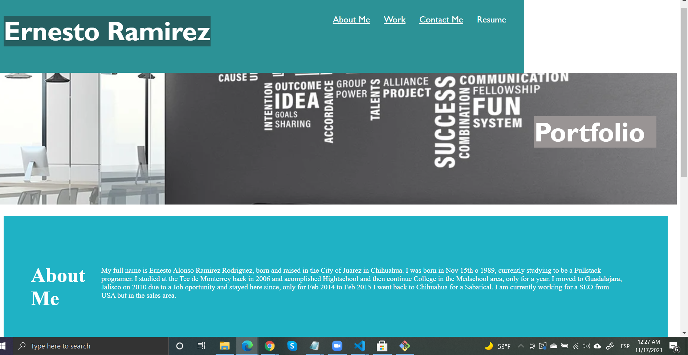

# Homework-Week2
# <Homework Week 2>

- The motivation to create this portfolio is to start showing how my progress as a programmer is up to date.
- I build this portfoliot to show how much I have learned through this weeks of training.
- Solves the challenge of building something from scratch and make sure every detail is covered.
- I learn different methods of placing pictures and boxes in a webpage as well to link them to different options I need.

## How to access
-The only step required for you to have access is to click on the link for you to open the web page created.
## Usage
The only purpose of the creation of this portfolio is to show one more time how my growth keeps increasing and increasing.
    
    

## Credit
Was Created by Ernesto Ramirez.

## Tests

https://ernest1589.github.io/Homework-Week2/

https://github.com/ernest1589/Homework-Week2